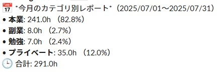

# Googleカレンダー集計ツール
Googleカレンダーの予定から「本業」「副業」「勉強」「プライベート」カテゴリごとの時間を自動集計し、Slackに週次・月次でレポート通知するGASツールです。

## 機能概要
- Googleカレンダーのイベントからカテゴリごとの稼働時間を自動集計
- 毎週月曜日に週次レポートをSlackへ通知、スプレッドシートへ出力
- 毎月末日に月次レポートをSlackへ通知、スプレッドシートへ出力
- Slack通知内容にはカテゴリ別時間と割合、合計時間が含まれる

## 構成ファイル
| ファイル名 | 説明 |
|------------|------|
| `weeklyReport.gs` | 週次レポート送信スクリプト |
| `monthlyReport.gs` | 月次レポート送信スクリプト |

## カスタマイズ
- 対象カレンダー名はスクリプト内の `calendarName` を変更してください
- SlackのWebhook URLをスクリプトに直接記述します（セキュリティに注意）

## 利用イメージ

## 利用方法
1. Google Apps Script にスクリプトをコピー
2. トリガーで `sendWeeklyReportToSlack` を毎週月曜に、`sendMonthlyReportToSlack` を毎月末日に設定

## 注意事項
- Googleカレンダーの予定タイトルに `[カテゴリ名]`（例: `[副業] 作業A`）の形式で記述する必要があります
